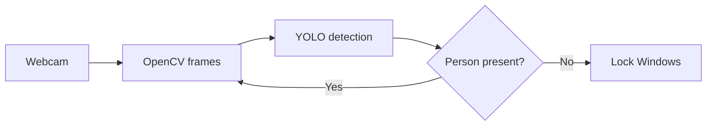

<!-- =========================================================
  Replace before publishing:
    YOUR_USERNAME  -> your GitHub username
    YOUR_LINKEDIN  -> your LinkedIn handle
    YOUR_EMAIL     -> your email address
    YOUR_PORTFOLIO -> your portfolio URL (without https://)
    YOUR_QBIYA_DEMO_URL -> live demo URL of Qbiya Store
  Palette: #0a0e1a (void) / #00f0ff (cyan) / #8b5cf6 (violet)
========================================================== -->

<div align="center">


<a href="https://github.com/YOUR_USERNAME">
  
</a>

<br/><br/>

<a href="https://github.com/YOUR_USERNAME"></a>
<a href="https://www.linkedin.com/in/YOUR_LINKEDIN"></a>
<a href="mailto:YOUR_EMAIL"></a>
<a href="https://YOUR_PORTFOLIO"></a>

<br/><br/>


</div>

<br/>

<div align="center">
  
</div>

```python
class Issam:
    name      = "Issam Oubenazha"
    roles     = ["Full Stack Developer", "Data & AI Enthusiast"]
    languages = ["Python", "JavaScript", "SQL"]
    focus     = ["Web apps", "Data pipelines", "Computer vision"]
    status    = "Learning, building, shipping."

    def mission(self):
        return "Build useful, modern software where clean engineering meets data and intelligence."
```

I design and build applications end to end: interfaces that feel effortless, backends that stay reliable, and data pipelines that turn raw information into decisions. I'm increasingly drawn to AI and computer vision, where code starts to perceive the real world. Every project is a chance to learn something new and make it genuinely useful.

<br/>

<div align="center">
  
</div>

<table align="center">
  <tr>
    <td width="170" align="center"><b>FRONTEND</b></td>
    <td>
      
    </td>
  </tr>
  <tr>
    <td align="center"><b>BACKEND</b></td>
    <td>
      
    </td>
  </tr>
  <tr>
    <td align="center"><b>DATA &amp; AI</b></td>
    <td>
      
      
      
      
    </td>
  </tr>
  <tr>
    <td align="center"><b>DATABASES</b></td>
    <td>
      
      
    </td>
  </tr>
  <tr>
    <td align="center"><b>CLOUD &amp; DEVOPS</b></td>
    <td>
      
      
      
      
    </td>
  </tr>
  <tr>
    <td align="center"><b>TOOLS</b></td>
    <td>
      
    </td>
  </tr>
</table>

<br/>

<div align="center">
  
</div>

<table align="center">
  <tr>
    <td>
      <sub><code>PROJECT 01 / DESKTOP / DATABASE</code></sub>
      <h3>AgriStock</h3>
      <p>A stock management application that keeps inventory organized and under control: products, quantities and movements, all stored reliably in MySQL behind a simple desktop interface.</p>
      <p>
        
        
        
      </p>
      <details>
        <summary><b>Inside the project</b></summary>
        <br/>
        <ul>
          <li>Product catalog and stock level tracking</li>
          <li>Persistent storage with a MySQL database</li>
          <li>Desktop UI built with Tkinter</li>
        </ul>
      </details>
      <a href="https://github.com/YOUR_USERNAME/AgriStock"></a>
    </td>
  </tr>
  <tr>
    <td>
      <sub><code>PROJECT 02 / COMPUTER VISION / AUTOMATION</code></sub>
      <h3>PC Presence Lock</h3>
      <p>A computer vision tool that watches the webcam, detects whether someone is sitting at the PC, and automatically locks Windows when nobody is there. Security that works without you thinking about it.</p>
      <p>
        
        
        
        
      </p>
      <details>
        <summary><b>How it works</b></summary>
        <br/>



      </details>
      <a href="https://github.com/YOUR_USERNAME/PC-Presence-Lock"></a>
    </td>
  </tr>
  <tr>
    <td>
      <sub><code>PROJECT 03 / WEB / E-COMMERCE</code></sub>
      <h3>Qbiya Store</h3>
      <p>A modern clothing e-commerce project with a clean, responsive storefront, built to make browsing a collection feel smooth and stylish on any screen.</p>
      <p>
        
        
        
        
      </p>
      <a href="https://YOUR_QBIYA_DEMO_URL"></a>
      <a href="https://github.com/YOUR_USERNAME/Qbiya-Store"></a>
    </td>
  </tr>
</table>

<br/>

<div align="center">
  

<p>
  
  
</p>


</div>

<br/>

<div align="center">
  <picture>
    <source media="(prefers-color-scheme: dark)" srcset="https://raw.githubusercontent.com/YOUR_USERNAME/YOUR_USERNAME/output/github-snake-dark.svg" />
    <source media="(prefers-color-scheme: light)" srcset="https://raw.githubusercontent.com/YOUR_USERNAME/YOUR_USERNAME/output/github-snake.svg" />
    
  </picture>
</div>

<br/>

<div align="center">
  
</div>

<table align="center">
  <tr>
    <td align="center" width="25%"><b>Advanced<br/>Data Engineering</b></td>
    <td align="center" width="25%"><b>Machine<br/>Learning</b></td>
    <td align="center" width="25%"><b>Cloud<br/>&amp; AWS</b></td>
    <td align="center" width="25%"><b>Advanced<br/>Full Stack</b></td>
  </tr>
</table>

<br/>

<div align="center">
  

<p>Open to collaboration, new ideas and interesting opportunities.</p>

<a href="https://www.linkedin.com/in/YOUR_LINKEDIN"></a>
<a href="https://github.com/YOUR_USERNAME"></a>
<a href="mailto:YOUR_EMAIL"></a>
<a href="https://YOUR_PORTFOLIO"></a>

<br/><br/>


</div>
