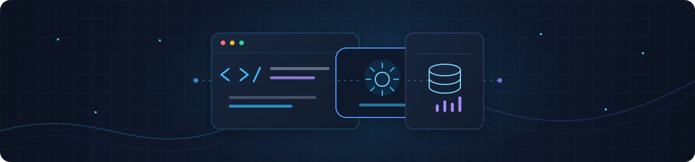

<div align="center">




<a href="https://github.com/YOUR_USERNAME">
  
</a>

<br/>

<p>
  <a href="https://github.com/YOUR_USERNAME"></a>
  <a href="https://www.linkedin.com/in/YOUR_LINKEDIN"></a>
  <a href="mailto:YOUR_EMAIL"></a>
  <a href="https://YOUR_PORTFOLIO"></a>
</p>


</div>

<br/>

## About Me

```python
class IssamOubenazha:
    name = "Issam Oubenazha"
    role = "Full Stack Developer"
    interests = ["Data Engineering", "Artificial Intelligence"]
    projects = ["E-commerce", "Desktop Inventory", "Computer Vision"]

    def about(self):
        return (
            "I build useful, modern applications with clean interfaces, "
            "reliable data pipelines, and AI features that add real value. "
            "I focus on practical, maintainable code."
        )

    def motto(self):
        return "Curious by nature. I learn by building real projects."
```

<br/>

## What I Do

<table align="center">
  <tr>
    <td align="center" width="20%">
      <br/><br/>
      <b>Full Stack Development</b><br/>
      <sub>End-to-end applications, from UI to database</sub>
    </td>
    <td align="center" width="20%">
      <br/><br/>
      <b>Data Engineering</b><br/>
      <sub>ETL processes and reliable data pipelines</sub>
    </td>
    <td align="center" width="20%">
      <br/><br/>
      <b>AI / Machine Learning</b><br/>
      <sub>Computer vision and intelligent automation</sub>
    </td>
    <td align="center" width="20%">
      <br/><br/>
      <b>Web Development</b><br/>
      <sub>Responsive, fast and modern websites</sub>
    </td>
    <td align="center" width="20%">
      <br/><br/>
      <b>Python Development</b><br/>
      <sub>Apps, automation and data tooling</sub>
    </td>
  </tr>
</table>

<br/>

## Tech Stack

<table align="center">
  <tr>
    <td width="140"><b>Frontend</b></td>
    <td>
      
    </td>
  </tr>
  <tr>
    <td><b>Backend</b></td>
    <td>
      
    </td>
  </tr>
  <tr>
    <td><b>Database</b></td>
    <td>
      
      
    </td>
  </tr>
  <tr>
    <td><b>Data</b></td>
    <td>
      
      
      
    </td>
  </tr>
  <tr>
    <td><b>Cloud</b></td>
    <td>
      
      
      
      
    </td>
  </tr>
  <tr>
    <td><b>Tools</b></td>
    <td>
      
    </td>
  </tr>
</table>

<br/>

## Featured Projects

<table align="center">
  <tr>
    <!-- AgriStock -->
    <td width="50%" valign="top">
      <h3>AgriStock</h3>
      <p>Inventory management desktop application to track products, stock levels and movements in a simple, efficient interface.</p>
      <p>
        
        
        
      </p>
      <p>
        <a href="https://github.com/YOUR_USERNAME/AgriStock"></a>
      </p>
    </td>
    <!-- PC Presence Lock -->
    <td width="50%" valign="top">
      <h3>PC Presence Lock</h3>
      <p>Computer vision application that detects whether someone is in front of the PC and can automatically lock the computer when nobody is present.</p>
      <p>
        
        
        
      </p>
      <p>
        <a href="https://github.com/YOUR_USERNAME/PC-Presence-Lock"></a>
      </p>
    </td>
  </tr>
  <tr>
    <!-- 9biya Store -->
    <td width="50%" valign="top">
      <h3>9biya Store</h3>
      <p>Modern clothing e-commerce website with a clean, responsive shopping experience.</p>
      <p>
        
        
        
        
      </p>
      <p>
        <a href="https://YOUR_9BIYA_DEMO_URL"></a>
        <a href="https://github.com/YOUR_USERNAME/9biya-store"></a>
      </p>
    </td>
    <!-- Online Exam Platform -->
    <td width="50%" valign="top">
      <h3>Online Exam Platform</h3>
      <p>Data analysis workflow with automatic results processing and statistics generation for online exams.</p>
      <p>
        
        
        
      </p>
      <p>
        <a href="https://github.com/YOUR_USERNAME/Online-Exam-Platform"></a>
      </p>
    </td>
  </tr>
</table>

<br/>

## GitHub Statistics

<div align="center">

<p>
  
  
</p>

<p>
  
</p>

<p>
  
</p>

</div>

<br/>

## Contribution Snake

<div align="center">
  <picture>
    <source media="(prefers-color-scheme: dark)" srcset="https://raw.githubusercontent.com/issam-oubenazha/issam-oubenazha/output/github-snake-dark.svg" />
    <source media="(prefers-color-scheme: light)" srcset="https://raw.githubusercontent.com/issam-oubenazha/issam-oubenazha/output/github-snake.svg" />
    
  </picture>
</div>

<br/>

## Currently Learning

<table align="center">
  <tr>
    <td align="center" width="25%">
      <b>Advanced Data Engineering</b><br/>
      <sub>Scalable pipelines and orchestration</sub>
    </td>
    <td align="center" width="25%">
      <b>Machine Learning</b><br/>
      <sub>Models, evaluation and deployment</sub>
    </td>
    <td align="center" width="25%">
      <b>Cloud / AWS</b><br/>
      <sub>Serverless and cloud architecture</sub>
    </td>
    <td align="center" width="25%">
      <b>Advanced Full Stack</b><br/>
      <sub>Architecture, performance and best practices</sub>
    </td>
  </tr>
</table>

<br/>

## Contact

<div align="center">

I'm open to collaboration, new ideas and interesting opportunities.

<p>
  <a href="https://www.linkedin.com/in/issam-oubenazha"></a>
  <a href="https://github.com/issam-oubenazha"></a>
  <a href="mailto:issamoubenzha@gmail.com"></a>
  <a href="https://https://issam-oubenazha.netlify.app/"></a>
</p>


</div>
